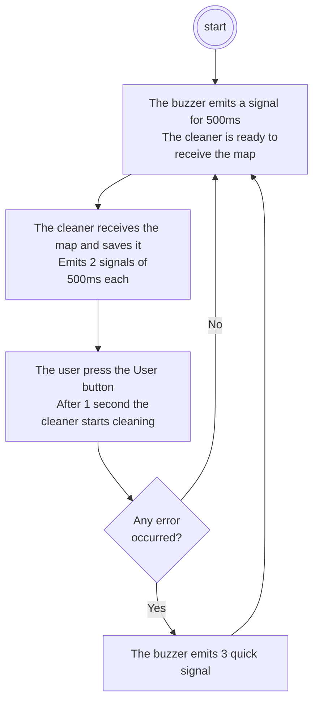

---
# try also 'default' to start simple
theme: default
# apply any windi css classes to the current slide
class: 'text-center'
# https://sli.dev/custom/highlighters.html
highlighter: shiki
# show line numbers in code blocks
lineNumbers: false
# persist drawings in exports and build
drawings:
  persist: false
# page transition
transition: slide-left
# use UnoCSS
css: unocss
layout: cover
---

# Floor Cleaner

---

## Overview

<div v-clicks>

  - **What** 
    * A floor cleaner that cleans an area represented by a map, which is drawn in a Desktop App
  - **How**
    * Python App for the map drawing
    * The Nucleo-L053R8 controls the cleaner
</div>

---
layout: image-right
image: ./images/app-create-map.png
---

## Python App (Map)

- Each cell represents an area of about 5cm * 5cm 
- A blue cell must be cleaned, a grey cell must not
- The black cell represents the position of the cleaner

---

## Python App (Map Conversion)

<div class="grid grid-rows-1 grid-cols-3 grid-flow-col centered-grid gap-x-10">

  

  <material-symbols-arrow-right-alt-rounded class="text-5xl"/>

  ```
  { 1, 1, 1, 1, 1, 0, 0, 0, 1, 1, 1,
    1, 1, 1, 1, 1, 0, 0, 0, 1, 1, 1,
    1, 1, 1, 0, 1, 0, 0, 0, 1, 1, 1,
    1, 1, 1, 0, 1, 0, 0, 0, 1, 1, 1,
    1, 1, 1, 0, 1, 0, 0, 0, 1, 1, 1,
    1, 1, 1, 0, 1, 0, 0, 0, 1, 1, 1,
    1, 1, 1, 1, 1, 1, 1, 1, 1, 1, 1,
    3, 1, 1, 1, 1, 1, 1, 1, 1, 1, 1,
    1, 1, 1, 1, 1, 1, 1, 1, 1, 1, 1,
    1, 1, 1, 1, 1, 1, 1, 1, 1, 1, 1,
    1, 1, 1, 1, 1, 1, 1, 1, 1, 1, 1,
    1, 1, 1, 1, 1, 1, 1, 1, 1, 1, 1,
    1, 1, 1, 1, 1, 1, 1, 1, 1, 1, 1 }
  ```

</div>

---

## Python App (Map Sending)

The Python app detects the Nucleo board, which is connected through USB, and can start to send the map:

```python {all|1|2|3-6|8-10|12|all}
with serial.Serial(port=serial_data.device, baudrate=9600) as cleaner_serial:
    cleaner_serial.write(b'&')
    cleaner_serial.write(bytes(str(len(cleaning_map)), encoding='ascii'))
    cleaner_serial.write(b'|')
    cleaner_serial.write(bytes(str(len(cleaning_map[0])), encoding='ascii'))
    cleaner_serial.write(b'|')

    for row in cleaning_map:
        for cell in row:
            cleaner_serial.write(cell.value.to_bytes(1, byteorder='big'))

    cleaner_serial.write(b'&')
```

---

## Cleaner Architecture

<div class="flex gap-x-10">
<div class="drawable-container">
  

  <EmptyCircle xcenter="8%" ycenter="22%" width="21%" height="33%" for="battery" v-if="$slidev.nav.clicks === 1" />
  <EmptyCircle xcenter="29%" ycenter="-5%" width="21%" height="30%" for="l298n" v-if="$slidev.nav.clicks === 2" />
  <EmptyCircle xcenter="8%" ycenter="75%" width="16%" height="25%" for="distance-sensor" v-if="$slidev.nav.clicks === 3" />
  <EmptyCircle xcenter="85%" ycenter="45%" width="16%" height="20%" for="vacuum" v-if="$slidev.nav.clicks === 4" />
  <EmptyCircle xcenter="11%" ycenter="3%" width="17%" height="20%" for="left-wheel" v-if="$slidev.nav.clicks === 5" />
  <EmptyCircle xcenter="51%" ycenter="3%" width="17%" height="20%" for="right-wheel" v-if="$slidev.nav.clicks === 6" />
  <EmptyCircle xcenter="32%" ycenter="48%" width="10%" height="14%" for="buzzer" v-if="$slidev.nav.clicks === 7" />
  
</div>

<v-clicks>

  - Battery
  - L298N
  - Distance Sensor
  - Vacuum
  - Left wheel
  - Right wheel
  - Buzzer

</v-clicks>

</div>

---

## Power Source

<div class="grid grid-rows-1 grid-cols-3 centered-grid grid-flow-col gap-x-10">

  

  <div v-show="[2, 3].includes($slidev.nav.clicks)" class="flex centered-flex gap-x-10">
  <material-symbols-arrow-circle-right-rounded class="text-5xl" />
  
  </div>

  <div v-show="$slidev.nav.clicks === 3" class="flex centered-flex gap-x-10">
  <material-symbols-arrow-circle-right-rounded class="text-5xl" />
  
  </div>

</div>

<v-clicks class="m-10">

  - 9V/1A battery
  - L298N
  - STM32 Board power-supplied by the E5V source

</v-clicks>

---

## L298N

<div class="flex gap-x-10">
<div class="drawable-container">
  

  <EmptyCircle xcenter="13%" ycenter="75%" width="27%" height="25%" for="12v-and-ground" v-if="$slidev.nav.clicks === 1" />
  <EmptyCircle xcenter="83%" ycenter="52%" width="18%" height="26%" for="wheel-ports" v-if="$slidev.nav.clicks === 2" />
  <EmptyCircle xcenter="0%" ycenter="53%" width="18%" height="26%" for="wheel-ports" v-if="$slidev.nav.clicks === 2" />
  <EmptyCircle xcenter="35%" ycenter="77%" width="16%" height="23%" for="board-power-source" v-if="$slidev.nav.clicks === 3" />
  <EmptyCircle xcenter="50%" ycenter="77%" width="40%" height="23%" for="in-ports" v-if="$slidev.nav.clicks === 4" />
  
</div>

<v-clicks>

  - 12V and Ground ports
  - Out ports (wheels)
  - Board source power
  - Input ports and PWM ports

</v-clicks>

</div>

---

## Cleaning Procedure

<div style="width: 100%; text-align: center">



</div>

---

## Map Saving

<v-clicks>

- Store the `row_count`
- Store the `column_count`
- Allocate 2 arrays:
  - `(CellType**) map_rows`: one of size `row_count` that contains the pointers to the map rows
  - `(CellType*) map`: another one of size `row_count * column_count` containing the map cells
- Read the entire map in one shot:
  ```c
  HAL_UART_Receive(huart, map, row_count * column_count, HAL_MAX_DELAY);
  ```

</v-clicks>

---

## Cleaning Algorithm

<div class="grid centered-grid grid-rows-2 grid-cols-2 gap-x-20">

<div id="path" class="grid grid-rows-3 grid-cols-4">
  <Cell from="right" />
  <Cell from="left" to="right" />
  <Cell from="left" to="right" />
  <Cell from="left" to="down" />
  <Cell from="down" to="right" />
  <Cell from="left" to="right" />
  <Cell from="left" />
  <Cell from="up" to="down" />
  <Cell from="right" to="up" />
  <Cell from="right" to="left" />
  <Cell from="right" to="left" />
  <Cell from="up" to="left" />
</div>

<div id="path" class="grid grid-rows-3 grid-cols-4">
  <Cell from="down" />
  <Cell invisible="true" />
  <Cell from="down" to="right" />
  <Cell from="left" to="down" />
  <Cell from="up" to="right" />
  <Cell from="left" to="right" />
  <Cell from="left" to="up" />
  <Cell from="up" centerContent="?" />
  <Cell />
  <Cell />
  <Cell />
</div>

**Simple case**: the cleaner never moves to an already-cleaned cell

**Complex case**: the cleaner moves to a cell surrounded by only unavailable or already-cleaned cells

</div>

<style>
  #path {
    width: 12em;
    height: 9em;
  }
</style>

---

## Cleaning Algorithm (Non-adjacent Cell Search)

<div class="grid centered-grid grid-rows-2 grid-cols-2 gap-x-20">

<div id="search" class="grid grid-rows-3 grid-cols-4">
  <Cell centerContent="X" />
  <Cell invisible="true" />
  <Cell centerContent="X" />
  <Cell centerContent="X" />
  <Cell centerContent="X" />
  <Cell centerContent="X" />
  <Cell centerContent="X" />
  <Cell centerContent="C" />
  <Cell />
  <Cell />
  <Cell centerContent="N" />
</div>

```
┌---┬---┬---┬---┬---┐
| 9 | 10| 11| 12| 13|
├---┼---┼---┼---┼---┤
|   | 1 | 2 | 3 | 14|
├---┼───┼───┼---┼---┤
|   │ 8 │ C │ 4 | 15|
├───┼───┼───┼---┼---┤
│   │ 7 │ 6 | 5 | 16|
├───┼───┼---┼---┼---┤
│   │ 20│ 19| 18| 17|
└───┴───┴---┴---┴---┘
```

<div id="search" class="grid grid-rows-5 grid-cols-5">
  <Cell isDashed="true" centerContent="X" />
  <Cell invisible="true" />
  <Cell centerContent="X" />
  <Cell centerContent="X" />
  <Cell centerContent="X" />
  <Cell centerContent="X" />
  <Cell centerContent="X" />
  <Cell centerContent="?" />
  <Cell />
  <Cell />
  <Cell centerContent="N🞋" />
</div>

**C** is the cleaner position, while **X** represents all the already-cleaned cells

</div>

<style>
  #path {
    width: 12em;
    height: 9em;
  }

  #search {
    width: 8em;
    height: 8em;
  }
</style>