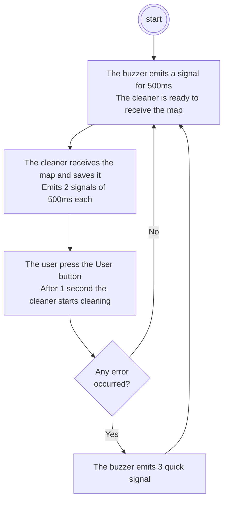

---
# try also 'default' to start simple
theme: default
# apply any windi css classes to the current slide
class: 'text-center'
# https://sli.dev/custom/highlighters.html
highlighter: shiki
# show line numbers in code blocks
lineNumbers: false
# persist drawings in exports and build
drawings:
  persist: false
# page transition
transition: slide-left
# use UnoCSS
css: unocss
layout: cover
---

# Floor Cleaner

---

## Overview

<v-clicks>

  - **What** 
    * A floor cleaner that cleans an area represented by a map, which is drawn in a Desktop App
  - **How**
    * Python App for the map drawing
    * The Nucleo-L053R8 controls the cleaner
</v-clicks>

---
layout: image-right
image: ./images/app-create-map.png
---

## Python App (Map)

<v-clicks>

- Each cell represents a small area that the cleaner can clean by just passing on it 
- A blue cell must be cleaned, a grey cell is like a virtual wall
- The black cell represents the position of the cleaner

</v-clicks>

---

## Python App (Map Conversion)

<div class="grid grid-rows-1 grid-cols-3 grid-flow-col centered-grid gap-x-10">

  

  <material-symbols-arrow-right-alt-rounded class="text-5xl"/>

  ```
  { 1, 1, 1, 1, 1, 0, 0, 0, 1, 1, 1,
    1, 1, 1, 1, 1, 0, 0, 0, 1, 1, 1,
    1, 1, 1, 0, 1, 0, 0, 0, 1, 1, 1,
    1, 1, 1, 0, 1, 0, 0, 0, 1, 1, 1,
    1, 1, 1, 0, 1, 0, 0, 0, 1, 1, 1,
    1, 1, 1, 0, 1, 0, 0, 0, 1, 1, 1,
    1, 1, 1, 1, 1, 1, 1, 1, 1, 1, 1,
    3, 1, 1, 1, 1, 1, 1, 1, 1, 1, 1,
    1, 1, 1, 1, 1, 1, 1, 1, 1, 1, 1,
    1, 1, 1, 1, 1, 1, 1, 1, 1, 1, 1,
    1, 1, 1, 1, 1, 1, 1, 1, 1, 1, 1,
    1, 1, 1, 1, 1, 1, 1, 1, 1, 1, 1,
    1, 1, 1, 1, 1, 1, 1, 1, 1, 1, 1 }
  ```

</div>

---

## Python App (Map Sending)

The Python app detects the Nucleo board, which is connected through USB, and starts sending the map:

```python {all|1|2|3-6|8-10|12|all}
with serial.Serial(port=serial_data.device, baudrate=9600) as cleaner_serial:
    cleaner_serial.write(b'&')
    cleaner_serial.write(bytes(str(len(cleaning_map)), encoding='ascii'))
    cleaner_serial.write(b'|')
    cleaner_serial.write(bytes(str(len(cleaning_map[0])), encoding='ascii'))
    cleaner_serial.write(b'|')

    for row in cleaning_map:
        for cell in row:
            cleaner_serial.write(cell.value.to_bytes(1, byteorder='big'))

    cleaner_serial.write(b'&')
```

---

## Cleaner Architecture (Version 1)

<div class="flex gap-x-10">
<div class="drawable-container">
  

  <EmptyCircle xcenter="8%" ycenter="22%" width="21%" height="33%" for="battery" v-if="$slidev.nav.clicks === 1" />
  <EmptyCircle xcenter="29%" ycenter="-5%" width="21%" height="30%" for="l298n" v-if="$slidev.nav.clicks === 2" />
  <EmptyCircle xcenter="8%" ycenter="75%" width="16%" height="25%" for="distance-sensor" v-if="$slidev.nav.clicks === 3" />
  <EmptyCircle xcenter="85%" ycenter="45%" width="16%" height="20%" for="vacuum" v-if="$slidev.nav.clicks === 4" />
  <EmptyCircle xcenter="11%" ycenter="3%" width="17%" height="20%" for="left-wheel" v-if="$slidev.nav.clicks === 5" />
  <EmptyCircle xcenter="51%" ycenter="3%" width="17%" height="20%" for="right-wheel" v-if="$slidev.nav.clicks === 6" />
  <EmptyCircle xcenter="32%" ycenter="48%" width="10%" height="14%" for="buzzer" v-if="$slidev.nav.clicks === 7" />
  
</div>

<v-clicks>

  - Battery
  - L298N
  - Distance Sensor
  - Vacuum
  - Left wheel
  - Right wheel
  - Buzzer

</v-clicks>

</div>

---

## Power Source

<div class="flex centered-flex gap-x-10">

  

  <div v-show="[2, 3].includes($slidev.nav.clicks)" class="flex centered-flex gap-x-10">
  <material-symbols-arrow-circle-right-rounded class="text-5xl" />
  
  </div>

  <div v-show="$slidev.nav.clicks === 3" class="flex centered-flex gap-x-10">
  <material-symbols-arrow-circle-right-rounded class="text-5xl" />
  
  </div>

</div>

<v-clicks class="m-10">

  - 9V/1A battery
  - L298N
  - STM32 Board power-supplied by the E5V source

</v-clicks>

---

## L298N

<div class="flex gap-x-10">
<div class="drawable-container">
  

  <EmptyCircle xcenter="13%" ycenter="75%" width="27%" height="25%" for="12v-and-ground" v-if="$slidev.nav.clicks === 1" />
  <EmptyCircle xcenter="83%" ycenter="52%" width="18%" height="26%" for="wheel-ports" v-if="$slidev.nav.clicks === 2" />
  <EmptyCircle xcenter="0%" ycenter="53%" width="18%" height="26%" for="wheel-ports" v-if="$slidev.nav.clicks === 2" />
  <EmptyCircle xcenter="35%" ycenter="77%" width="16%" height="23%" for="board-power-source" v-if="$slidev.nav.clicks === 3" />
  <EmptyCircle xcenter="50%" ycenter="77%" width="40%" height="23%" for="in-ports" v-if="$slidev.nav.clicks === 4" />
  
</div>

<v-clicks>

  - 12V and Ground ports
  - Out ports (wheels)
  - Board source power
  - Input ports and PWM ports

</v-clicks>

</div>

---

## Distance Sensor

<div class="flex gap-x-10">
<div class="drawable-container">
  

  <EmptyCircle xcenter="20%" ycenter="80%" width="24%" height="20%" for="out" v-if="$slidev.nav.clicks === 1" />
  <EmptyCircle xcenter="36%" ycenter="80%" width="24%" height="20%" for="gnd" v-if="$slidev.nav.clicks === 2" />
  <EmptyCircle xcenter="51%" ycenter="80%" width="24%" height="20%" for="vcc" v-if="$slidev.nav.clicks === 3" />
  <EmptyCircle xcenter="45%" ycenter="40%" width="45%" height="25%" for="potentiometer" v-if="$slidev.nav.clicks === 4" />
  <EmptyCircle xcenter="15%" ycenter="-3%" width="78%" height="33%" for="ir" v-if="$slidev.nav.clicks === 5" />
  
</div>

<v-clicks>

- OUT
- GND
- 3.3V
- Potentiometer
- Infrared emitter/receiver

</v-clicks>
</div>

---
layout: image-right-fit
image: ./images/cleaner_mounted_v1.png
---

## Cleaner Architecture (Issues and Limits)

This cleaner architecture has some issues/limitations:

<v-clicks>

- The motors are not precise enough (optical encoders mitigated this issue)
- 9V is a too low voltage to power source the entire circuit. The original battery was 14V.
- **Limited communication with the Desktop Application**

</v-clicks>

---

## Cleaner Architecture (Version 2)

<div class="flex gap-x-10">
<div class="drawable-container">
  

  <EmptyCircle xcenter="-3%" ycenter="14%" width="24%" height="16%" for="distance-sensor" v-if="$slidev.nav.clicks === 1" />
  <EmptyCircle xcenter="43%" ycenter="15%" width="10%" height="15%" for="vacuum" v-if="$slidev.nav.clicks === 2" />
  <EmptyCircle xcenter="27%" ycenter="17%" width="17%" height="20%" for="left-wheel" v-if="$slidev.nav.clicks === 3" />
  <EmptyCircle xcenter="27%" ycenter="4%" width="17%" height="20%" for="right-wheel" v-if="$slidev.nav.clicks === 4" />
  <EmptyCircle xcenter="52.5%" ycenter="18%" width="9%" height="13%" for="buzzer" v-if="$slidev.nav.clicks === 5" />
  <EmptyCircle xcenter="43%" ycenter="-3%" width="45%" height="25%" for="lcd" v-if="$slidev.nav.clicks === 6" />
  
</div>

<v-clicks>

  - Distance Sensor
  - Vacuum
  - Left wheel
  - Right wheel
  - Buzzer
  - LCD Display

</v-clicks>

</div>

---

## LCD Display

<v-clicks>

- It is a 1602A LCD display, that I have set on 4-bit mode
- The potentiometer is used to adjust the screen brightness
- It shows the cleaner's actions or informational messages

</v-clicks>

---

## Cleaning Procedure

<div style="width: 100%; text-align: center">



</div>

---

## Map Saving

<v-clicks>

- Store the `row_count`
- Store the `column_count`
- Allocate 2 arrays:
  - `(CellType**) map_rows`: one of size `row_count` that contains the pointers to the map rows
  - `(CellType*) map`: another one of size `row_count * column_count` containing the map cells
- Read the entire map in one shot:
  ```c
  HAL_UART_Receive(huart, map, row_count * column_count, HAL_MAX_DELAY);
  ```

</v-clicks>

---

## Cleaning Algorithm

<div class="grid centered-grid grid-rows-2 grid-cols-2 gap-x-20">

<div class="path grid grid-rows-3 grid-cols-4">
  <Cell from="right" />
  <Cell from="left" to="right" />
  <Cell from="left" to="right" />
  <Cell from="left" to="down" />
  <Cell from="down" to="right" />
  <Cell from="left" to="right" />
  <Cell from="left" />
  <Cell from="up" to="down" />
  <Cell from="right" to="up" />
  <Cell from="right" to="left" />
  <Cell from="right" to="left" />
  <Cell from="up" to="left" />
</div>

<div class="path grid grid-rows-3 grid-cols-4">
  <Cell from="down" />
  <Cell invisible="true" />
  <Cell from="down" to="right" />
  <Cell from="left" to="down" />
  <Cell from="up" to="right" />
  <Cell from="left" to="right" />
  <Cell from="left" to="up" />
  <Cell from="up" centerContent="?" />
  <Cell />
  <Cell />
  <Cell />
</div>

**Simple case**: the cleaner never moves to an already-cleaned cell

**Complex case**: the cleaner moves to a cell surrounded by only unavailable or already-cleaned cells

</div>

<style>
  .path {
    width: 12em;
    height: 9em;
  }
</style>

---

## Cleaning Algorithm (Non-adjacent Cell Search)

<div class="flex centered-flex">

<div id="path_complex" class="grid grid-rows-3 grid-cols-5">
  <Cell color="#9BF3FF" />
  <Cell invisible="true" />
  <Cell color="#9BF3FF" textColor="black" centerContent="1" />
  <Cell color="#9BF3FF" textColor="black" centerContent="2"/>
  <Cell isDashed="true" centerContent="3"/>
  <Cell color="#9BF3FF" />
  <Cell color="#9BF3FF" />
  <Cell color="#9BF3FF" />
  <Cell color="#9BF3FF" textColor="black" centerContent="C" />
  <Cell isDashed="true" centerContent="4"/>
  <Cell />
  <Cell />
  <Cell centerContent="7"/>
  <Cell isDashed="true" centerContent="6"/>
  <Cell isDashed="true" centerContent="5"/>
</div>

</div>

<v-clicks>

- **C** is the cleaner position
- light blue cells have already been cleaned
- The search order is defined by the squares of edge 3, 5, 7 etc that enclose the current cell
- The target cell is the first non-cleaned cell found

</v-clicks>

<style>
  #path_complex {
    width: 15em;
    height: 9em;
  }
</style>

---

## Moving to the Non-adjacent Cell

<v-clicks>

- The path to the target cell is created by the [A* Algorithm](https://github.com/BigZaphod/AStar)
- During the time from the current to the target cell, the cleaner will not clean

</v-clicks>

---

## Cleaner Movements (#1)

While driving forward, the cleaner checks for obstacles:

```c {all|1-3|5|8,9|11-21|23,24|all}
*obstacle_found = false;
bool undo_drive = false;
bool was_target_reached;

HAL_NVIC_EnableIRQ(EXTI4_15_IRQn);

// modified from HAL_Delay(Delay)
HAL_GPIO_WritePin(motorsInfo->left2_GPIOType, motorsInfo->left2_pin, GPIO_PIN_SET); // ACW
HAL_GPIO_WritePin(motorsInfo->right1_GPIOType, motorsInfo->right1_pin, GPIO_PIN_SET); // CW

uint32_t tickstart = HAL_GetTick();
uint32_t wait = millis_to_drive;
uint32_t undo_delay;

while((undo_delay = HAL_GetTick() - tickstart) < wait)
{
  if (*obstacle_found) {
    undo_drive = true;
    break;
  }
}

HAL_GPIO_WritePin(motorsInfo->left2_GPIOType, motorsInfo->left2_pin, GPIO_PIN_RESET);
HAL_GPIO_WritePin(motorsInfo->right1_GPIOType, motorsInfo->right1_pin, GPIO_PIN_RESET);

// ...
```

<style> 
  .slidev-layout {
    --slidev-code-font-size: 0.6rem;
    --slidev-code-line-height: calc(0.6rem * 1.5); 
  }
</style> 

---

## Cleaner Movements (#2)

```c{all|2|3-11|12-25|28|all}
MapPosition next_position;
get_next_position_while_driving_forward(cleanerInfo, &next_position);
if (!undo_drive) {
  cleanerInfo->position.row = next_position.row;
  cleanerInfo->position.col = next_position.col;

  was_target_reached = true;

  send_new_cleaner_position_command(huart, cleanerInfo->position.row, cleanerInfo->position.col, cleaning_enabled);
  Lcd_clear_and_write(lcd, "Going forward");
}
else {
  // drive backward because of obstacle
  HAL_GPIO_WritePin(motorsInfo->left1_GPIOType, motorsInfo->left1_pin, GPIO_PIN_SET); // CW
  HAL_GPIO_WritePin(motorsInfo->right2_GPIOType, motorsInfo->right2_pin, GPIO_PIN_SET); // ACW

  HAL_Delay(undo_delay);

  HAL_GPIO_WritePin(motorsInfo->left1_GPIOType, motorsInfo->left1_pin, GPIO_PIN_RESET);
  HAL_GPIO_WritePin(motorsInfo->right2_GPIOType, motorsInfo->right2_pin, GPIO_PIN_RESET);

  send_obstacle_command(huart, next_position.row, next_position.col);
  Lcd_clear_and_write(lcd, "Obstacle found");

  was_target_reached = false;
}

HAL_NVIC_DisableIRQ(EXTI4_15_IRQn);
return was_target_reached;
```

<style> 
  .slidev-layout {
    --slidev-code-font-size: 0.6rem;
    --slidev-code-line-height: calc(0.6rem * 1.5); 
  }
</style> 

---

## Distance Sensor

If an obstacle is detected, the interrupt is disabled until the next `drive_forward` command

```c{all|5,6|all}
void HAL_GPIO_EXTI_Callback(uint16_t GPIO_Pin)
{
	if(GPIO_Pin == GPIO_PIN_9 && is_driving) // If The INT Source Is EXTI Line9 (A9 Pin)
	{
		HAL_NVIC_DisableIRQ(EXTI4_15_IRQn);
		is_obstacle_found = true;
	}
}
```

---

## Realtime Updates

The cleaner, once started, sends update messages to the Desktop Application. These messages are used to show the cleaning status.

The messages are:

<v-clicks>

- `START{}`
- `MOVE{'r':1,'c':2,'cleaning_enabled':true}`
- `OBSTACLE{'r':1,'c':2}`
- `END{'ret_code':0}`

</v-clicks>

---

## Updates Transmission

Every message is sent asynchronously with the DMA:

```c{all|1|8|10|all}
while (__HAL_UART_GET_FLAG(huart, UART_FLAG_TC) != SET);

uint8_t current_command_size = strlen(raw_command);
uint8_t final_command_size = current_command_size + 1; // 1 is for the \n

memset(buf, 0, sizeof(buf));
strcat(buf, raw_command);
buf[current_command_size] = '\n';

HAL_UART_Transmit_DMA(huart, (uint8_t *) buf, final_command_size);
```

---

## Testing

The cleaning algorithm has been tested independently using a different configuration:

<v-clicks>

- The entry point is `Src/tests/driving_test.c`, compiled with a custom `Makefile`
- The `TESTING` macro is enabled and hides all the MCU-specific code (including the obstacle detection logic)
- I have used `min_unit.h` as testing library

</v-clicks>