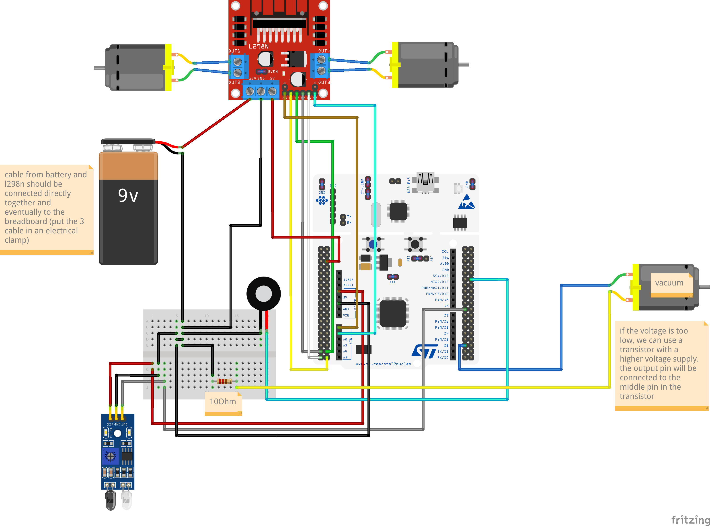
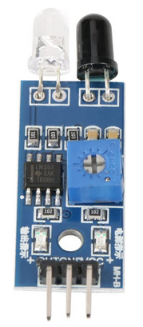
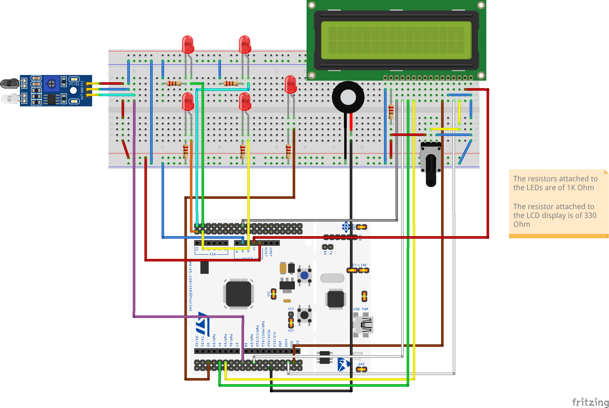

# Floor Cleaner

The project consists of a floor cleaner, which is controlled by a Desktop Application. The user can draw a map on this app and the robot will try to go over each available cell in the map.

### Project Structure

The project root folder contains:

- The `app` folder with the Desktop application. Execute it with `./run.sh`
- The `cleaner` folder with the Nucleo board source code and the tests for the algorithm used. Note: the optimization level must be set to **2** (`-O2`): *Properties* -> *C/C++ Build* -> *Settings* -> *MCU GCC Compiler* -> *Optimization* -> Set to *Optimize more (-O2)*. The C standard used is **GNU11** (`-std=gnu11`): *Properties* -> *C/C++ Build* -> *Settings* -> *MCU GCC Compiler* -> *General* -> Set the Language standard to *GNU11 (...)*.

---

## Desktop Application

The Desktop application has been developped in Python with the support of PyQT6 for the graphical interface.

### Map Drawing
The map is represented by a grid of cells, each of these cover an area of 5cm * 5cm. There are 3 types of cells:

- UNAVAILABLE (grey in the grid): the cleaner should not go through it
- TO_CLEAN (blue in the grid): this cell must be cleaned in order to complete the cleaning procedure
- CLEANER_POSITION (black in the grid): the initial position of the cleaner

Initially, all cells are unavailable, but the user can mark them as to-clean by selecting them with a mouse press and release action. To place the cleaner in the map, search for the *Cleaner* label in the menu and then click on *Place Cleaner*. The next cell to be selected will be the cleaner position.

### Serial communication details
Once the map is ready, the user can connect the cleaner with an USB cable and go to *File* -> *Send* to start the sending procedure.

**Note**: it is important to connect the cleaner before opening the send dialog because it is initialized with the currently available ports:

```
from serial.tools import list_ports, list_ports_common

# ...

for i, serial_data in enumerate(list_ports.comports()):
    self._combo_box_serial.insertItem(
        i, serial_data.description, userData=serial_data)
```

After selecting the identifier for the Nucleo Board, the python app starts to transmit the bytes of the map with a baudrate of 9600.

### Map Transformation

The transmitted map is the smallest rectangle that includes all the to-clean cells in the grid. This means that there will never be a boundary row or column where all cells are unavailable.

Then the optimized grid is transformed into a matrix and each cell becomes a byte, in particular:

- UNAVAILABLE = 0x00
- TO_CLEAN = 0x01
- CLEANER_POSITION = 0x03

The 0x02 value does not exist yet but corresponds to the ALREADY_CLEANED value.

### Sending Protocol

In order for the map to be correctly interpreted by the Nucleo board, data are transmitted as bytes in the following order:

1. The character `&`, which represents the start (and the end) of the data flow
2. The number of rows in the map
3. The character `|`
4. The number of columns in the map
5. The character `|`
6. The map's cells, row by row from left to right
7. The character `&`

### Realtime Cleaning Window

Once the map has been sent, a new window opens, showing the drawn map. This map cannot be updated by the user, but is updated automatically by the messages that receives from the cleaner. After the user starts the cleaner, the latter will start sending messages about the new positions or obstacles on its way. See below for the messages format.

---

## Floor Cleaner

The cleaner will go through each to-clean cell in the received grid and avoids those that are marked as unavailable.

### Architecture and Components

During the development of the project, the architecture have changed. The main reason was to accomodate the window for the realtime updates of the cleaner.

The first architecture included the motors (wheels) and was externally power-sourced. It is described by this Fritzing schema:



#### Power Source
The power source consists of 2 batteries of 9V each, linked in parallel in order to increase the amperage. Each battery has an amperage of 1000mAh. Unfortunately, I have not found a light battery with a voltage of 12V, which would have increased the amount of components I could have added to the circuit.

#### L298N


This component is directly connected with the batteries and supplies power to:
- The 2 motors (wheels) using the output pins from OUT1 to OUT4
- The Nucleo board using the 5V pin, enabled via a jumper that regulates the input voltage

I can use the pins IN1-IN4 to control the motors direction, as described by the following table:

| IN1 | IN2 | Spinning direction |
| --- | --- | ------------------ |
| 0 | 0 | Motor OFF |
| 0 | 1 | Backward |
| 1 | 0 | Forward |
| 1 | 1 | Motor OFF |

ENA and ENB are used to modulate the voltage that the output ports OUT1-OUT4 receive. These pins are connected to 2 PWM enabled pins, which are A0 and A1 in the Nucleo board.

#### IR Distance Sensor



The map is built by the user, but the cleaner might find some unpredictable obstacles on its way. To avoid any collisions, an IR distance sensor is used. This sensor has 3 pins:

- OUT: When a module detects an obstacle, the OUT port emits a low level signal that will be processed by the Nucleo board.
- GND
- VCC: this port is connected to the 3.3V pin of the Nucleo board

This component also has a potentiomenter that can adjust the IR sensor sensibility. Basically, it can detect obstacle from 2cm to 30cm, depending on the potentiometer value.

#### Buzzer

A buzzer informs the user about the cleaner's state:

- A single beep of 500ms: the cleaner is ready to receive a new map (and has successfully cleaned the previous map is present).
- 2 beeps of 500ms, interspersed by a beep of 300ms: the cleaner has received the map and is ready to drive
- 3 beeps of 300ms, interspersed by 2 beeps of 150ms: the cleaner has received an error while driving

---

### The Second Architecture 

The first architecture has some issues:

- The motors were not precise enough and a wheel could spin faster than the other. The motors were recycled from an old cleaner and each of them have a optical encoder mounted on it. I did not use it but it would have definitely improved the speed synchronization.
- 9V is probably too low to power-source the entire cleaner, the original battery was 14V.
- The window for realtime update was not possible because the cleaner moves freely and cannot be attached to the USB cable.

The second architecture is conceptually very similar to the previous one because the only difference is that it is power-sourced directly from the USB and the L298N connections have been replaced with LEDs. The only additional component is a LCD display that shows informational messages.



#### LCD Display

The LCD display is a 1602A LCD, that I have set on 4-bit mode. I have also used a potentiometer to adjust the screen brightness.

---

### Map Processing

The cleaner receives the map from the UART pin PA3. I have used the polling mode because the cleaner does not need to do anything else in the meanwhile.

The reading process is optimized to speed up the data saving. In fact, after reading the `row_count` and `column_count`, I allocate 2 arrays:

- `(CellType**) map_rows`: one of size `row_count` that contains the pointers to the map rows
- `(CellType*) map`: another one of size `row_count * column_count` containing the map cells

Assuming to have a map of 3 rows and 2 columns, this is how the 2 arrays are filled:

```

map:                                ┌───┬───┐
                      ┌───────────> │   │   │
                      │             ├───┼───┤
                      │   ┌───────> │   │   │
                      │   │         ├───┼───┤
                      │   │   ┌───> │   │   │
                      │   │   │     └───┴───┘
                      │   │   │
                      │   │   │
                      │   │   │
                    ┌───┬───┬───┐
map_rows:           │   │   │   │
                    └───┴───┴───┘
```

In this way, I can read the entire map at once by passing the `map` array as buffer. I am sure that the `map` array is a continuous block of memory, but I can access it through the `map_rows` array because it contains the pointers to the map rows.

The map data are placed in a struct of type `MapInfo`:

```
typedef struct MapInfo {
	uint8_t** map;
	uint16_t row_count;
	uint16_t column_count;
} MapInfo;
```

---

### Driving Preparation

Once the cleaner has received the entire map, the user can instruct the cleaner to start by pressing the user button on the Nucleo board. After about 1 second, the `start_drive` method is called and the cleaner will start driving:

```
HAL_TIM_Base_Start(&htim2); // Init PWM for motors' speed modulation
HAL_TIM_PWM_Start(&htim2, TIM_CHANNEL_1);
HAL_TIM_PWM_Start(&htim2, TIM_CHANNEL_2);

MotorsInfo motorsInfo = {
		.left1_GPIOType = MOTOR_1___IN1_GPIO_Port, .left1_pin = MOTOR_1___IN1_Pin,
        // ...
};
CleanComponentsInfo cleanComponentsInfo = { .vacuum_GPIOType = VACUUM_GPIO_Port, .vacuum_pin = VACUUM_Pin };
is_driving = true;
int result_code = start_drive(&mapInfo, &is_obstacle_found, &motorsInfo, &cleanComponentsInfo);
```

The `start_drive` method expects a list of struct that contains the components info, as well as a boolean flag, which is `is_obstacle_found`, that will be explained later.

As for the `result_code`, the only successful return code is 0, whereas the other are interpreted as error codes.

#### Cleaner Initialization

Before starting to clean, I initialize the `CleanerInfo` struct with its initial position in the map and its direction, that by default is `UP`. If the cleaner position cannot be found in the map, the `start_drive` returns 1.

#### Move Cleaner to the Start Position

For simplicity, the cleaner will always start cleaning from the top-left cell of the map, or to the one nearest to it if the top-left one is unavailable. The details on how the cleaner reaches the initial position are described later in the part dedicated to the driving algorithm.

If the initial position cannot be found or the cleaner cannot reach it, then the codes returned are 2 and 3, respectively.

---

### The Cleaning Algorithm

The cleaner will clean the entire area of the map starting from the top-left cell that must be clean and proceeding to the right. The logic is very simple: the cleaner will always maintain an unavailable cell on its left. In this way, it starts from the perimeter and progressively reaches the center of the area.

For the simplest case (a rectangle/square), the path that the cleaner follows is indicated by the dashed line:

```
┌───┬───┬───┬───┐
│ --│---│---│-┐ │
├───┼───┼───┼───┤
│ ┌-│---│-> │ │ │
├───┼───┼───┼───┤
│ └-│---│---│-┘ │
└───┴───┴───┴───┘
```

As far as the next cell to clean is adjacent to the current one, the next cell position can be easily computed by inspecting the surrounding cells. However, it is not always possible to have such a linear path, for example with this map:

```
┌───┬───┐   ┌───┬───┐
│---│-┐ │   │ ┌-│->?│
├───┼───┼───┼───┼───┘
│   │ └-│---│-┘ │
├───┼───┼───┼───┤
│   │   │   │   │
└───┴───┴───┴───┘
```

Once the cleaner reaches the top-right cell, there is no adjacent cell available. In this case, I need to search for the nearest reachable cell that is marked as to-clean, then I need a path-finding algorithm that can take the cleaner there.

The algorithm that looks for the nearest reachable cell firstly visit the square of cells that surround the current cell. If it does not find any to-clean cell, then it extends the radius of the square by 1 and so on until it finds a reachable cell (or until all the area has been cleaned). For example, in the following map:

```
┌───┬───┐   ┌───┬───┐
│ X │ X │   │ X │ C │
├───┼───┼───┼───┼───┘
│   │ X │ X │ X │
├───┼───┼───┼───┤
│   │   │   │ N │
└───┴───┴───┴───┘

C = cleaner
X = unavailable
N = next position
```

The target position (`N`) is the first one available while visiting the square of radius 2 from the cleaner position. In the next map I represented the order of visit of the cells around `C` (actually, some rows and columns are discarded in advanced, like those outside the map boundaries).

```
┌---┬---┬---┬---┬---┐
| 9 | 10| 11| 12| 13|
├---┼---┼---┼---┼---┤
|   | 1 | 2 | 3 | 14|
├---┼───┼───┼---┼---┤
|   │ 8 │ C │ 4 | 15|
├───┼───┼───┼---┼---┤
│   │ 7 │ 6 | 5 | 16|
├───┼───┼---┼---┼---┤
│   │ 20│ 19| 18| 17|
└───┴───┴---┴---┴---┘
```

The path to the target cell, which is the one having `id = 20`, is found by the path-finding algorithm. The one I have chosen is the A* and the current implementation can be found on [this page](https://github.com/BigZaphod/AStar).

While crossing the path from a cell to a non-adjacent cell, the cleaner disables the brush because it likely crosses only already-cleaned cells. This optimization is supposed to saves some energy. The driving algorithm stops when there is no more cell to clean or when an error occurs.

---

### Cleaner Movements

There are 3 methods that control the motors that move the cleaner. 

`drive_forward` moves the cleaner of one cell along the current direction: 

```
static bool drive_forward(CleanerInfo* cleanerInfo, bool* obstacle_found, MotorsInfo* motorsInfo) {
	*obstacle_found = false;
	bool undo_drive = false;
	bool was_target_reached;
    // ...
```

`obstacle_found` is a global variable that is set when the IR distance sensor detects an obstacle. This is necessary to stop the cleaner and avoid the collision.

```
    // ...
#ifndef __TESTING__
    HAL_NVIC_EnableIRQ(EXTI4_15_IRQn);

	HAL_GPIO_WritePin(motorsInfo->left2_GPIOType, motorsInfo->left2_pin, GPIO_PIN_SET); // ACW
	HAL_GPIO_WritePin(motorsInfo->right1_GPIOType, motorsInfo->right1_pin, GPIO_PIN_SET); // CW
    uint32_t tickstart = HAL_GetTick();
    uint32_t wait = millis_to_drive;
    uint32_t undo_delay;

    while((undo_delay = HAL_GetTick() - tickstart) < wait)
    {
    	if (*obstacle_found) {
    		undo_drive = true;
    		break;
    	}
    }

    HAL_GPIO_WritePin(motorsInfo->left2_GPIOType, motorsInfo->left2_pin, GPIO_PIN_RESET);
    HAL_GPIO_WritePin(motorsInfo->right1_GPIOType, motorsInfo->right1_pin, GPIO_PIN_RESET);
#endif
    // ...
```

The above code is modified from the `HAL_Delay()` method because I need to wait for `millis_to_drive` milliseconds while the motors spin and move the cleaner. However, I could need to stop the cleaner early in case of obstacle, which would set the `undo_drive` flag.

```

    if (!undo_drive) {
    	uint16_t current_row = cleanerInfo->position.row;
    	uint16_t current_col = cleanerInfo->position.col;

    	switch (cleanerInfo->direction) {
    	case UP: current_row--; break;
    	case RIGHT: current_col++; break;
    	case DOWN: current_row++; break;
    	case LEFT: current_col--; break;
    	}

    	cleanerInfo->position.row = current_row;
    	cleanerInfo->position.col = current_col;

        was_target_reached = true;
    }
    else {
#ifndef __TESTING__
        // drive backward because of obstacle
        HAL_GPIO_WritePin(motorsInfo->left1_GPIOType, motorsInfo->left1_pin, GPIO_PIN_SET); // CW
    	HAL_GPIO_WritePin(motorsInfo->right2_GPIOType, motorsInfo->right2_pin, GPIO_PIN_SET); // ACW

    	// TODO: what if an obstacle is found while going back
        HAL_Delay(undo_delay);

        HAL_GPIO_WritePin(motorsInfo->left1_GPIOType, motorsInfo->left1_pin, GPIO_PIN_RESET);
    	HAL_GPIO_WritePin(motorsInfo->right2_GPIOType, motorsInfo->right2_pin, GPIO_PIN_RESET);
#endif

        was_target_reached = false;
    }

#ifndef __TESTING__
    HAL_NVIC_DisableIRQ(EXTI4_15_IRQn);
#endif

	return was_target_reached;
}
```

Here I have 2 possible outcomes: the `undo_drive` is set, it is not. In the former case, the cleaner must move backwards and will mark the target cell as unavailable because of the obstacle found. In this case, the motors spin backwards for `undo_delay` milliseconds, which corresponds to the same time spent by the cleaner in trying to reach the target cell. When the `undo_drive` flag is clear, then the cleaner position is updated

The other 2 methods to move the cleaner are `turn_left` and `turn_right`, but do not move the cleaner to another cell, they simply change its direction. The cleaner rotates clockwise or anticlockwise around its center. Here the code for the `turn_left`:

```
static void turn_left(CleanerInfo* cleanerInfo, MotorsInfo* motorsInfo) {
#ifndef __TESTING__
	HAL_GPIO_WritePin(motorsInfo->left1_GPIOType, motorsInfo->left1_pin, GPIO_PIN_SET); // CW
	HAL_GPIO_WritePin(motorsInfo->right1_GPIOType, motorsInfo->right1_pin, GPIO_PIN_SET); // CW

	HAL_Delay(millis_to_turn);

	HAL_GPIO_WritePin(motorsInfo->left1_GPIOType, motorsInfo->left1_pin, GPIO_PIN_RESET);
	HAL_GPIO_WritePin(motorsInfo->right1_GPIOType, motorsInfo->right1_pin, GPIO_PIN_RESET);
#endif

	// adding 3 is like subtracting 1 with modulo 4
	cleanerInfo->direction = (cleanerInfo->direction + 3) % 4;
}
```

The `__TESTING__` regions are created to disable the enclosing code when the `__TESTING__` directive is set.

---

### Obstacle Detection

When an obstacle is detected, the distance sensor emits a low signal that the `PA9` pin intercepts and processes. Pin `PA9` works in interrupt mode and the callback globally sets the `obstacle_found` flag:

```
void HAL_GPIO_EXTI_Callback(uint16_t GPIO_Pin)
{
	if(GPIO_Pin == GPIO_PIN_9 && is_driving) // If The INT Source Is EXTI Line9 (A9 Pin)
	{
		HAL_NVIC_DisableIRQ(EXTI4_15_IRQn);
		is_obstacle_found = true;
	}
}
```

This interrupt is enabled when the `drive_forward` method is called and disabled at the end of it. Afterall, the obstacle sensor is useful only when the cleaner moves in the current direction, not even when it turns left or right because its position does not change.

---

### Realtime Updates

After the map has been sent and the cleaner starts, each new position and obstacle found in the cleaner's way are communicated to the Desktop application using the serial interface. 4 types of messages will be sent:

- `START{}`: it is the first message the cleaner sends and indicates that the cleaner started cleaning
- `MOVE{'r':1,'c':2,'cleaning_enabled':true}`: it is sent when the cleaner moves to a new cell. This command has 3 parameters: the row and column of the new cell and `cleaning_enabled`, that specifies whether it is currently cleaning. The cleaner will not clean cells where it has already cleaned.
- `OBSTACLE{'r':1,'c':2}`: it is sent when a cleaner encounters an obstacle, the parameters are the obstacle position
- `END{'ret_code':0}`: it is the last message to be sent and also specifies the return code (0 if the cleaning was successful, > 0 otherwise).

Depending on the message received, the Desktop application updates the realtime map. In particular, the cleaned cells get colored of green, while obstacles get colored of red.

---

### Testing the Algorithm

It is possible to test the driving algorithm exclusively by compiling with a slightly different option: `-D__TESTING__`. This directive hides all the `HAL_` calls and the tests just verify that, at the end, the to-clean cells have been actually cleaned. The code enclosed in the `#ifndef __TESTING__` regions is not compiled because it contains superfluous calls for the algorithm testing.

The testing library is [minunit](https://github.com/siu/minunit) and tests can be run with `make run`.


