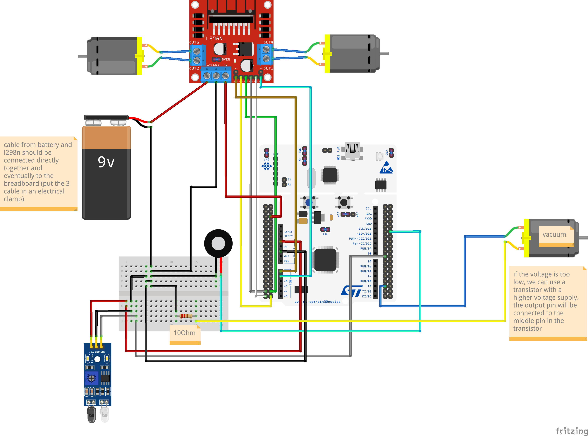

# Floor Cleaner

The project consists of a floor cleaner, which is controlled by a Desktop Application. The user can draw a map on this app and the robot will try to go over each available cell in the map.

---

## Desktop Application

The Desktop application has been developped in Python with the support of PyQT6 for the graphical interface.

### Map Representation
The map is represented by a grid of cells, each of these cover an area of 5cm * 5cm. There are 3 types of cells:

- UNAVAILABLE (grey in the grid): the cleaner should not go through it
- TO_CLEAN (blue in the grid): this cell must be cleaned in order to complete the cleaning procedure
- CLEANER_POSITION (black in the grid): the initial position of the cleaner

Initially, all cells are unavailable, but the user can mark them as to-clean by selecting them with a mouse press and release action. To place the cleaner in the map, search for the *Cleaner* label in the menu and then click on *Place Cleaner*. The next cell to be selected will be the cleaner position.

### Serial communication details
Once the map is ready, the user can connect the cleaner with an USB cable and go to *File* -> *Send* to start the sending procedure.

**Note**: it is important to connect the cleaner before opening the send dialog because it is initialized with the currently available ports:

```
from serial.tools import list_ports, list_ports_common

# ...

for i, serial_data in enumerate(list_ports.comports()):
    self._combo_box_serial.insertItem(
        i, serial_data.description, userData=serial_data)
```

After selecting the identifier for the Nucleo Board, the python app starts to transmit the bytes of the map with a baudrate of 9600.

### Map Transformation

The transmitted map is the smallest rectangle that includes all the to-clean cells in the grid. This means that there will never be a boundary row or column where all cells are unavailable.

Then the optimized grid is transformed into a matrix and each cell becomes a byte, in particular:

- UNAVAILABLE = 0x00
- TO_CLEAN = 0x01
- CLEANER_POSITION = 0x03

The 0x02 value does not exist yet but corresponds to the ALREADY_CLEANED value.

### Sending Protocol

In order for the map to be correctly interpreted by the Nucleo board, data are transmitted using a simple but quite efficient protocol. These are, in order, the sent bytes:

1. The character `&`, which represents the start (and the end) of the data flow
2. The number of rows in the map
3. The character `|`
4. The number of columns in the map
5. The character `|`
6. The map's cells, row by row from left to right
7. The character `&`

---

## Floor Cleaner

The cleaner will go through each to-clean cell in the received grid and avoids those that are marked as unavailable.

### Architecture and Components
The architecture is described by this Fritzing schema:



#### Power Source
The power source consists of 2 batteries of 9V each, linked in parallel in order to increase the amperage. Each battery has an amperage of 1000mAh. Unfortunately, I have not found a light battery with a voltage of 12V, which would have increased the amount of components I could have added to the circuit.

#### L298N


This component is directly connected with the batteries and supplies power to:
- The 2 motors (wheels) using the output pins from OUT1 to OUT4
- The Nucleo board using the 5V pin, enabled via a jumper that regulates the input voltage

It can receive up to 12V-2A in input from the 12V input pin and I can use the pins IN1-IN4 to control the motors direction. ENA and ENB are used to modulate the voltage that the output ports OUT1-OUT4 receive.


